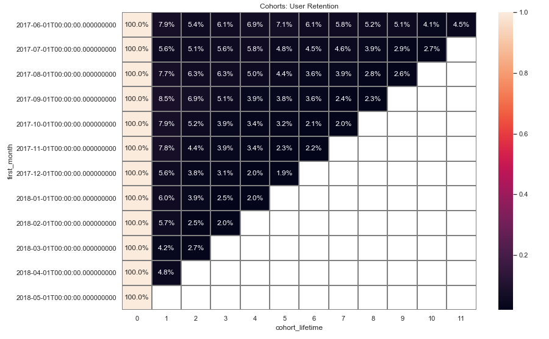
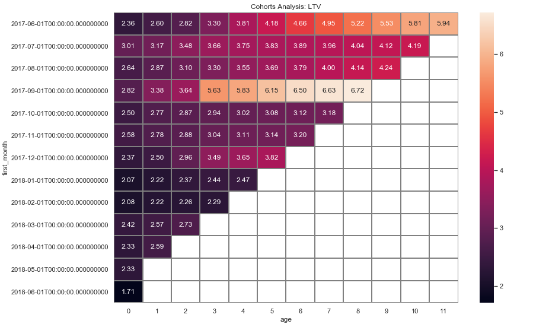
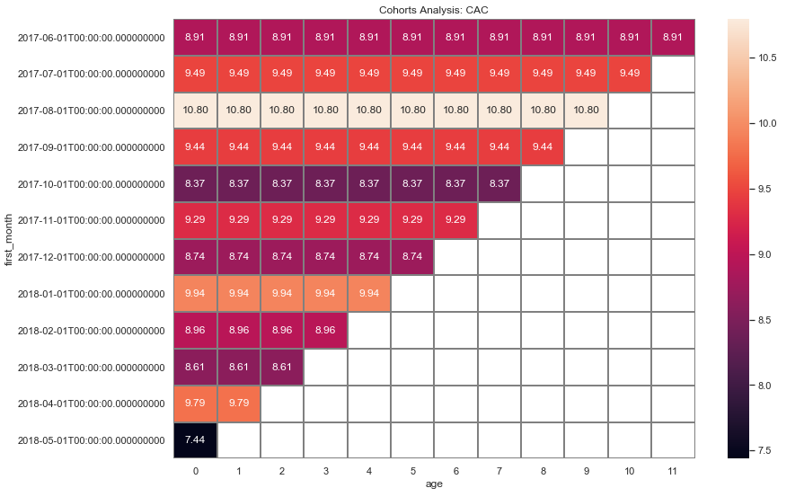
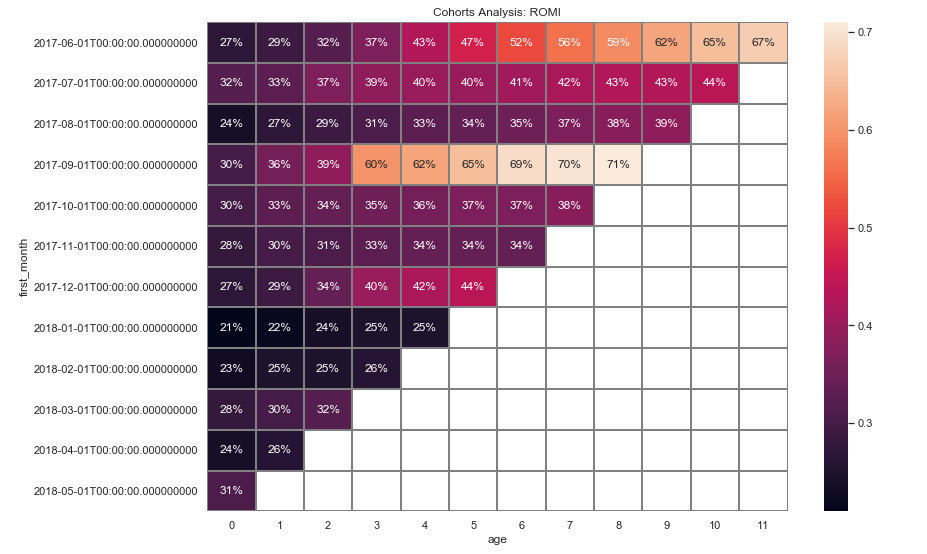

# Business Metrics of Yandex Afisha

   
 

## [Detailed Project Link](https://nbviewer.org/github/Emmanuel-Nti/business_metrics_yandex_afisha_nti/blob/master/business_metrics_nti.ipynb) 

## How I Approached the Project
- Importation of the data and libraries
- Preprocessed the data for analysis 
- Reports and Metrics (Cohort Analysis)
  - Products: Visits to the product, sessions, retention
  - Sales: Orders, Lifetime Value (LTV), Customer Acquisition Cost(CAC)
  - Marketing: Return on Marketing Investment (ROMI)
- Conclusion and recommendation

## Daily Visits to Yandex Afisha
Amazingly, 24 November, 2017 was a black friday; it had the highest number of visits to Yandex Afesha. 
March 31, 2018 was a popular holiday plus observances Worldwide. This means, holidays affected visits to Yandex Afisha but black friday stimulated visits.

   
 

## Sessions Per Day Vs Visits Per Day
Unsuprisingly, sessions per day mimics visits per day.

   
 

 
##  User Retention by Cohort
The June 2017 cohort had the highest retention rate as at month 11. By the first month (month 1), all cohorts had retention rates less than 10%. 

   
 

 
 
## LTV Cohort Analysis
The June 2017 cohort had the longest duration of LTV; contributed the longest time. However, the September 2017 cohort had the highest LTV. 
May and June 2018 cohorts had the least LTVs.

   
 

 
 
## CAC Cohort Analysis
CAC per cohorts shows a uniform but different costs for each cohort.The August 2017 cohort had the highest cost in a given month while the May 2018 cohort had the least.

   
 

 
 
## ROMI Cohort Analysis
The September 2017 cohort had the highest return on investments, followed by the June 2017 cohort. 
May 2018 cohort had the lowest return on investments. No cohort has recouped 100% of invesments.

   
 

## General Findings
- On average, about 907 people use Yandex.Afisha every day, about 5621 people use Yandex Afisha every week, and about 23228 people use Yandex Afisha every month.
- The highest daily visits occur on a black friday and the lowest daily visits occur on a holiday
- On average, there is about 1 session per day, and each session lasts about 60 seconds.
- By the first month (month 1), all cohorts had retention rates less than 10%. None of the May 2018 cohort came back after their first visit. Only June 2017 cohort were retained till month 11.
- The December 2017 users made about 4400 orders (the highest), this is followed by October 2017, and November 2017. Users in the months June, July, and August have the least number of orders.
- On average, people start buying within 0 minutes (immediately), and the average purchase size is about 5.00 dollars.
- The June 2017 cohort contributed the longest time but the September 2017 cohort had the highest LTV. May and June 2018 cohorts had the least LTVs.
- CAC per month/cohorts shows a uniform but different costs for each cohort.The August 2017 cohort had the highest cost in a given month while the May 2018 cohort had the least.
- Users of platforms/source 1 and 2 bring in the highest revenue, and users of platform 7 bring in the least.
- Plaform 3 has the highest cost but it is amongst the least revenue generators.
- Platforms 1 and 2 brings in the highest revenue, and amongst the least in cost. They are the most profitable platforms.
- The investments in all the sources are not yet worthwhile as the highest (source 1) is yet to recoup 100% of investment. Also, investments by cohorts is not yet worthwhile.

## Recommendation
- I would recommend the marketing experts to invest more in sources 1 and 2 and cut costs on plaform 3; without plaform 3, revenues would exceed cost.

## Libraries Used
- Pandas 
- Numpy 
- Seaborn 
- Plotly
- Matplotlib    
